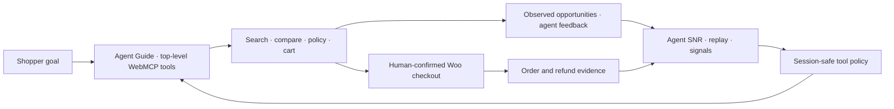

# Agent SNR

**Agent outcome monitoring for WordPress.**

Agent SNR separates trustworthy business signal from raw agent noise: browser agents operate a real WooCommerce storefront through WebMCP, while merchants replay the privacy-safe workflow, see site-observed opportunities beside structured agent feedback, connect human handoffs to paid/refunded outcomes, and govern the site-tool layer. SNR uses its established engineering meaning: **signal-to-noise ratio**.

> See what agents did. Hear what they experienced. Discover what your site is missing.

> **Devpost status:** repository-local preparation is complete, but the entry still requires the entrant's public repository, frozen HTTPS demo, public sub-three-minute YouTube video, identity/eligibility/IP sign-off, and final submission before **September 3, 2026 at 1:00 p.m. PDT**. Follow the [official-rule checklist](submission/devpost-rules-checklist.md); unchecked items are not claimed complete.

The familiar investigation pattern combines journey replay, tool observability, and product analytics for website agents. Here, “replay” means a redacted event-sourced workflow timeline—not DOM capture, video, or pixel reconstruction. See [PRODUCT.md](PRODUCT.md) for the monitoring model, comparative research, and MVP boundaries.

### v0.1 scope

This repository is the challenge-ready demo prototype. Public tool execution and session-scoped analytics require the explicit server-side `WMCP_AGENTSNR_DEMO_MODE` gate. A normal install starts disabled and provides the authenticated persistent policy/diagnostics shell, but site-wide authenticated WebMCP analytics execution is not claimed in v0.1.

| Submission resource | Status |
|---|---|
| Live HTTPS demo | Owner must deploy and add the public URL |
| Public repository | Local Git history is ready; owner must create and push the public remote |
| Video | Script and run sheet are included; owner must record and publish a sub-three-minute YouTube video |
| Presentation | Editable 12-slide deck: [`submission/agent-snr-hackathon-demo.pptx`](submission/agent-snr-hackathon-demo.pptx) |
| Demo rehearsal | Isolated exact-ZIP launcher plus [`demo/HACKATHON_RUNBOOK.md`](demo/HACKATHON_RUNBOOK.md) |
| Captured proof | Ten real local-flow screenshots and a run summary in [`submission/demo-screenshots/`](submission/demo-screenshots/); [capture notes](submission/demo-screenshots.md) |
| Plugin artifact | Reproducibly built as `dist/wmcp-agentsnr-0.1.0.zip` with a SHA-256 sidecar |
| Playground | Reproducibly built as `dist/wmcp-agentsnr-playground-0.1.0.zip` |
| License | [GPL-2.0-or-later](LICENSE) |
| Devpost compliance | [Rule-by-rule checklist and pre-submission release record](submission/devpost-rules-checklist.md) |

## The closed loop



The browser runtime uses the current imperative API, `document.modelContext.registerTool()`. WordPress Abilities remain the canonical server-side registry; a narrow same-origin REST gateway adds anonymous demo-session authorization, policy, idempotency, rate limiting, and the workflow ledger.

A simplified excerpt makes the required browser contract easy to find; the production runtime registers every manifest tool dynamically in [`webmcp-runtime.js`](plugin/wmcp-agentsnr/assets/js/webmcp-runtime.js#L568):

```js
await document.modelContext.registerTool({
	name: "search_products",
	description: "Search the public product catalog with structured constraints.",
	inputSchema: manifestTool.inputSchema,
	execute: ( input, options ) =>
		runtime.executeTool( "search_products", input, options, manifest ),
});
```

## Standards status and external validation

WebMCP is a proposed browser API and [W3C Community Group draft](https://webmachinelearning.github.io/webmcp/), not a W3C Recommendation. Agent SNR targets the current imperative API and follows the official Chrome guidance for [workflow design](https://developer.chrome.com/docs/ai/webmcp/build-tools), [evals](https://developer.chrome.com/docs/ai/webmcp/evals), and [tool security](https://developer.chrome.com/docs/ai/webmcp/secure-tools). The accepted journey, trust, failure, and evidence contract is in [submission/webmcp-readiness-design.md](submission/webmcp-readiness-design.md).

Validation is intentionally layered: deterministic repository tests; pinned GoogleChromeLabs WebMCP Evals smoke and protected model-backed runs documented in [evals/README.md](evals/README.md); then required real-client confirmation of the frozen release in the latest ChatGPT in-app browser or Chrome 149+ with WebMCP enabled. The [Workbench evidence sheet](submission/workbench-validation.md) and [WebMCP.com scanner/directory handoff](submission/webmcp-directory-listing.md) are optional supplemental checks, not challenge submission requirements. Public-host and real-client confirmation remains an explicit owner gate until actual results are recorded.

## Judge prompts

Shopper:

```text
Start with this site's Agent Guide. Find a waterproof backpack under $100
with at least IPX5 protection. If none match, show the closest in-stock
options and explain the constraint. Compare the two best, verify the return
policy, add the compact option, stop at checkout, and follow the guide's
feedback instructions.
```

Merchant:

```text
Monitor my current agent session, replay its tool and commerce timeline,
identify the slowest or failed invocation, connect it to the commerce outcome,
separate site-observed opportunities from agent-reported feedback and verified
measurements, and summarize current controls.
```

Governance:

```text
Disable product comparison for this demo session.
```

## What is included

- Two independent top-level WebMCP surfaces: storefront and Agent SNR.
- A single first-party catalog that generates WordPress Abilities and WebMCP manifests.
- A versioned Agent Guide that makes supported journeys, feedback triggers, privacy, reversible effects, and the human checkout boundary discoverable to agents and people.
- Product discovery, evidence-based comparison, published policy facts, reversible cart writes, checkout handoff, automatic opportunity detection, structured agent feedback, and compatible capability-gap capture.
- Workflow events, tool outcomes/latency, funnel analysis, order/refund linkage, deterministic attribution, and redacted explanations.
- Restrictive session overrides, persistent admin policy boundaries, rate limits, replay protection, and a global kill switch.
- Accessible visible state for every meaningful tool result; the human storefront still works when WebMCP is absent.
- Twelve original fictional products and original SVG artwork.
- Docker reproduction, installable ZIP, WordPress Playground packaging, browser tests, and submission materials.
- A visually verified architecture/demo deck, isolated exact-artifact rehearsal, canonical runbook, and real evidence screenshots.

## Quick start

Prerequisites: Docker Desktop (or Docker Engine with Compose) and a free local port 18080. Override it with `WMCP_HTTP_PORT` when needed. The clean-clone showcase auto-build also needs `rsync` and `zip`; a supplied prebuilt ZIP does not.

```bash
./bin/start-demo.sh
```

The command starts WordPress 7.1/PHP 8.3, MariaDB 11.8, and WooCommerce 11.0.1; activates the plugin; seeds the fictional Agent SNR Demo Store; and prints the dedicated storefront demo, Agent SNR, readiness, and admin URLs. Local-only credentials are printed by the command.

Stop without deleting data:

```bash
./bin/stop-demo.sh
```

### Deploy on Render

The production Blueprint creates a public WordPress service and a private MariaDB service from pinned images, with generated secrets, persistent uploads/database storage, HTTPS-aware configuration, disabled auto-deploys, and idempotent demo setup. Review the cost and credential steps in the [Render deployment runbook](submission/render-deployment.md), then [create the Blueprint from the public repository](https://render.com/deploy?repo=https://github.com/jiga/webmcp-agentSNR).

Reset only this repository's named Docker volumes and rebuild:

```bash
./bin/reset-local-demo.sh --yes
```

### Isolated hackathon rehearsal

Use the showcase launcher for recording or judge rehearsal. It runs the checksummed release ZIP—not a source bind mount—as the separate Compose project `agent-snr-showcase` on port `18084`, leaving the ordinary development stack and its data untouched. On a clean clone with no ignored `dist/*.zip`, `start` first builds the deterministic ZIP and checksum from the current checkout, then mounts that verified artifact.

```bash
./bin/start-showcase.sh start
./bin/start-showcase.sh verify
```

Follow the single-session shopper → human checkout → Workflow Replay → governance → refund story in [demo/HACKATHON_RUNBOOK.md](demo/HACKATHON_RUNBOOK.md). The matching editable deck is [submission/agent-snr-hackathon-demo.pptx](submission/agent-snr-hackathon-demo.pptx), and the checked-in local reference captures are under [submission/demo-screenshots/](submission/demo-screenshots/).

Stop the isolated project without deleting its data:

```bash
./bin/start-showcase.sh stop
```

## Build the plugin

```bash
npm ci
npm run verify
npm run build
```

The release build produces a checksummed ZIP in `dist/`. The ZIP extracts to a single `wmcp-agentsnr/` plugin directory and contains no tests, local configuration, nested archives, or development dependencies.

Build the reproducible WordPress Playground bundle as well:

```bash
npm run build:playground
```

The bundle places `blueprint.json` at its root, installs the same plugin ZIP and pinned WooCommerce version, reuses the canonical seeder, and includes checksum/iframe-diagnostic notes.

For a manual WordPress install, upload the ZIP under **Plugins → Add Plugin → Upload Plugin**. Clean installs remain disabled by default. The explicit demo seeder enables WebMCP only when `WMCP_AGENTSNR_DEMO_MODE` is set server-side.

## Compatibility targets

| Layer | Minimum | Primary release target |
|---|---:|---:|
| WordPress | 6.9.4 | 7.1 |
| PHP | 8.1 | 8.3/8.4 |
| WooCommerce | 10.9.4 | 11.0.1 |
| Checkout | Classic shortcode | Classic shortcode |
| Orders | Legacy storage | HPOS enabled |
| Browser | Chrome 149+ test flag | Latest ChatGPT in-app browser or Chrome 149+ |

Checkout Block compatibility is intentionally not claimed in v0.1: a gateway needs a separate Blocks payment-method integration. The seeded demo uses classic checkout so the no-charge human confirmation path is real and testable.

### WebMCP judging environment

The official challenge path is the latest ChatGPT desktop in-app browser, which supports WebMCP by default, or Google Chrome 149+ with `chrome://flags/#enable-webmcp-testing` enabled. The submitted demo must be a normal top-level HTTPS WordPress page. Playground remains a portability sandbox because its iframe is not the judging baseline.

## Security and privacy model

- A 256-bit `HttpOnly`, `SameSite=Lax` demo cookie; only its SHA-256 hex digest is stored.
- Short-lived signed guest CSRF tokens bound to session, surface, site, and expiry.
- Exact same-origin checks, schema validation, payload caps, fixed-window limits, and idempotency keys.
- Permission callbacks fail closed unless the verified execution controller installs a request-scoped context.
- Public analytics queries scope in SQL to the current demo-session hash.
- The Agent SNR workflow ledger does not store raw conversations, prompts, identities, addresses, cookies, nonces, authorization headers, payment fields, or arbitrary tool payloads. Ordinary WooCommerce remains the system of record for order details a human submits at checkout.
- Search opportunities persist only canonical server-owned demand signatures; feedback accepts enums and evidence IDs, never free-form comments or caller-supplied metric values.
- Agent testimony is labeled `agent_reported`; site observation and site-computed measurements remain separate evidence classes.
- Tool content is structured, sanitized, bounded, and marked untrusted when it originates from merchant-authored catalog or policy data.
- The agent can prepare checkout but cannot create an order, accept terms, submit customer data, charge, cancel, or refund.

See [SECURITY.md](SECURITY.md) for threat boundaries and [TESTING.md](TESTING.md) for the release matrix.

## Project structure

```text
plugin/wmcp-agentsnr/  Installable WordPress plugin source
tests/                 Unit, integration, browser, Woo, and security tests
demo/                  Seed data and Playground package
bin/                   Reproducible build/bootstrap/smoke scripts
submission/            Devpost copy, judge steps, screenshots, video, final checks
tasks/                 Local implementation checklist and review notes
```

## Development

```bash
npm run lint:js
npm run lint:css
npm run test:js
./bin/lint-php.sh
```

With the isolated showcase already running, regenerate the ten local reference captures and run summary with:

```bash
npx playwright install chromium
npm run showcase:capture
```

The capture is intentionally stateful: it creates and fully refunds one no-charge local WooCommerce order and records a session-only comparison-tool restriction inside its disposable browser scope. It publishes the image/summary set only after the entire run succeeds. It defaults to localhost; remote capture requires HTTPS, an explicit opt-in, and explicit operator credentials.

PHP and WordPress integration suites run in containers so host PHP is not required. Browser-native WebMCP is injected/mocked in CI; verification in at least one official judging path—the latest ChatGPT in-app browser or Chrome 149+ with WebMCP enabled—remains a release-blocking manual check.

### Verification snapshot

The current renamed checkout passes 125 JavaScript/configuration tests—including Render Blueprint/bootstrap guards and the refund-evidence capture regression—111 PHP tests / 1,964 assertions, schema parity, JavaScript/CSS lint, Coding Standards with zero errors, and deterministic `wmcp-agentsnr` plugin/Playground builds. The renamed exact ZIP also passes REST/security smoke, 16/16 Chromium scenarios, 11/11 native WebMCP calls, legacy and HPOS Woo lifecycle, the WordPress 6.9 / 7.0.4 / 7.1 cross-version matrix, Plugin Check with zero errors, fresh screenshot capture, presentation QA, and two-start Render persistence/health verification. Protected model-backed evidence at rename-bound commit `410c198963ec649ed58e21fce7c80103db3d0ad8` passes 54/54 storefront selections, 45/45 Agent SNR selections, and an 8/8 live browser journey with zero console errors and no new order. Only hosted HTTPS/official-client validation remains an external evidence gate; see [submission/verification-report.md](submission/verification-report.md).

## Hackathon provenance

Executable implementation began August 29, 2026. There was no pre-existing executable application code; prior work consisted of market research, architecture, and product specification. See [HACKATHON.md](HACKATHON.md).

## Contributing and license

See [CONTRIBUTING.md](CONTRIBUTING.md). The project is licensed under [GPL-2.0-or-later](LICENSE). The submitted open-source core is not intended to be re-closed after the challenge.
