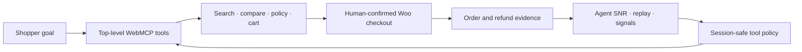

# Agent SNR

**Agent outcome monitoring for WordPress.**

Agent SNR separates trustworthy business signal from raw agent noise: browser agents operate a real WooCommerce storefront through WebMCP, while merchants replay the privacy-safe workflow, see reliability and capability signals, connect human handoffs to paid/refunded outcomes, and govern the site-tool layer. SNR uses its established engineering meaning: **signal-to-noise ratio**.

The familiar investigation pattern resembles **LogRocket/Fullstory for website agents**, combined with Datadog-style tool health and Amplitude-style commerce outcomes. Here, “replay” means a redacted event-sourced workflow timeline—not DOM capture, video, or pixel reconstruction. See [PRODUCT.md](PRODUCT.md) for the monitoring model and MVP boundaries.

### v0.1 scope

This repository is the challenge-ready demo prototype. Public tool execution and session-scoped analytics require the explicit server-side `WMCP_AGENTOPS_DEMO_MODE` gate. A normal install starts disabled and provides the authenticated persistent policy/diagnostics shell, but site-wide authenticated WebMCP analytics execution is not claimed in v0.1.

| Submission resource | Status |
|---|---|
| Live HTTPS demo | Owner must deploy and add the public URL |
| Public repository | Local Git history is ready; owner must create and push the public remote |
| Video | Script and run sheet are included; owner must record and publish a sub-three-minute YouTube video |
| Presentation | Editable 11-slide deck: [`submission/agent-snr-hackathon-demo.pptx`](submission/agent-snr-hackathon-demo.pptx) |
| Demo rehearsal | Isolated exact-ZIP launcher plus [`demo/HACKATHON_RUNBOOK.md`](demo/HACKATHON_RUNBOOK.md) |
| Captured proof | Seven real local-flow screenshots and a run summary in [`submission/demo-screenshots/`](submission/demo-screenshots/); [capture notes](submission/demo-screenshots.md) |
| Plugin artifact | Reproducibly built as `dist/wmcp-agentops-0.1.0.zip` with a SHA-256 sidecar |
| Playground | Reproducibly built as `dist/wmcp-agentops-playground-0.1.0.zip` |
| License | [GPL-2.0-or-later](LICENSE) |

## The closed loop



The browser runtime uses the current imperative API, `document.modelContext.registerTool()`. WordPress Abilities remain the canonical server-side registry; a narrow same-origin REST gateway adds anonymous demo-session authorization, policy, idempotency, rate limiting, and the workflow ledger.

## Judge prompts

Shopper:

```text
Find a waterproof backpack under $120, compare the two best choices,
confirm that the return policy is at least 30 days, and add the best-value
option to my cart.
```

Capability gap:

```text
Find the blue TerraRoll 25 Pack and notify me when it is back in stock.
If the store cannot do that, say so honestly, record the capability gap,
and do not pretend a notification was created.
```

Merchant:

```text
Monitor my current agent session, replay its tool and commerce timeline,
identify the slowest or failed invocation, connect it to the commerce outcome,
show any capability signals this store does not support, and summarize current controls.
```

Governance:

```text
Disable product comparison for this demo session.
```

## What is included

- Two independent top-level WebMCP surfaces: storefront and Agent SNR.
- A single first-party catalog that generates WordPress Abilities and WebMCP manifests.
- Product discovery, evidence-based comparison, published policy facts, reversible cart writes, checkout handoff, and capability-gap capture.
- Workflow events, tool outcomes/latency, funnel analysis, order/refund linkage, deterministic attribution, and redacted explanations.
- Restrictive session overrides, persistent admin policy boundaries, rate limits, replay protection, and a global kill switch.
- Accessible visible state for every meaningful tool result; the human storefront still works when WebMCP is absent.
- Twelve original fictional products and original SVG artwork.
- Docker reproduction, installable ZIP, WordPress Playground packaging, browser tests, and submission materials.
- A visually verified architecture/demo deck, isolated exact-artifact rehearsal, canonical runbook, and real evidence screenshots.

## Quick start

Prerequisites: Docker Desktop (or Docker Engine with Compose) and a free local port 18080. Override it with `WMCP_HTTP_PORT` when needed. The clean-clone showcase auto-build also needs `rsync` and `zip`; a supplied prebuilt ZIP does not.

```bash
./bin/start-demo.sh
```

The command starts WordPress 7.1/PHP 8.3, MariaDB 11.8, and WooCommerce 11.0.1; activates the plugin; seeds the fictional TrailForge Lab store; and prints the dedicated storefront demo, Agent SNR, readiness, and admin URLs. Local-only credentials are printed by the command.

Stop without deleting data:

```bash
./bin/stop-demo.sh
```

Reset only this repository's named Docker volumes and rebuild:

```bash
./bin/reset-local-demo.sh --yes
```

### Isolated hackathon rehearsal

Use the showcase launcher for recording or judge rehearsal. It runs the checksummed release ZIP—not a source bind mount—as the separate Compose project `agent-snr-showcase` on port `18084`, leaving the ordinary development stack and its data untouched. On a clean clone with no ignored `dist/*.zip`, `start` first builds the deterministic ZIP and checksum from the current checkout, then mounts that verified artifact.

```bash
./bin/start-showcase.sh start
./bin/start-showcase.sh verify
```

Follow the single-session shopper → human checkout → Workflow Replay → governance → refund story in [demo/HACKATHON_RUNBOOK.md](demo/HACKATHON_RUNBOOK.md). The matching editable deck is [submission/agent-snr-hackathon-demo.pptx](submission/agent-snr-hackathon-demo.pptx), and the checked-in local reference captures are under [submission/demo-screenshots/](submission/demo-screenshots/).

Stop the isolated project without deleting its data:

```bash
./bin/start-showcase.sh stop
```

## Build the plugin

```bash
npm ci
npm run verify
npm run build
```

The release build produces a checksummed ZIP in `dist/`. The ZIP extracts to a single `wmcp-agentops/` plugin directory and contains no tests, local configuration, nested archives, or development dependencies.

Build the reproducible WordPress Playground bundle as well:

```bash
npm run build:playground
```

The bundle places `blueprint.json` at its root, installs the same plugin ZIP and pinned WooCommerce version, reuses the canonical seeder, and includes checksum/iframe-diagnostic notes.

For a manual WordPress install, upload the ZIP under **Plugins → Add Plugin → Upload Plugin**. Clean installs remain disabled by default. The explicit demo seeder enables WebMCP only when `WMCP_AGENTOPS_DEMO_MODE` is set server-side.

## Compatibility targets

| Layer | Minimum | Primary release target |
|---|---:|---:|
| WordPress | 6.9.4 | 7.1 |
| PHP | 8.1 | 8.3/8.4 |
| WooCommerce | 10.9.4 | 11.0.1 |
| Checkout | Classic shortcode | Classic shortcode |
| Orders | Legacy storage | HPOS enabled |
| Browser | Chrome 149+ test flag | Current ChatGPT desktop Site Tools / Chrome |

Checkout Block compatibility is intentionally not claimed in v0.1: a gateway needs a separate Blocks payment-method integration. The seeded demo uses classic checkout so the no-charge human confirmation path is real and testable.

### ChatGPT availability caveat

Site Tools currently require the latest ChatGPT desktop app, a ChatGPT Work or Codex workspace, Site Tools permission, and a supported model (GPT-5.6 Sol or Terra at the time of release preparation). Tools in iframes and declarative form tools are not discovered. The primary submitted demo must therefore be a normal top-level HTTPS WordPress page; Playground is a portability sandbox, not the judging baseline.

## Security and privacy model

- A 256-bit `HttpOnly`, `SameSite=Lax` demo cookie; only its SHA-256 hex digest is stored.
- Short-lived signed guest CSRF tokens bound to session, surface, site, and expiry.
- Exact same-origin checks, schema validation, payload caps, fixed-window limits, and idempotency keys.
- Permission callbacks fail closed unless the verified execution controller installs a request-scoped context.
- Public analytics queries scope in SQL to the current demo-session hash.
- No raw conversations, prompts, identities, addresses, cookies, nonces, authorization headers, payment fields, or arbitrary tool payloads are stored.
- Tool content is structured, sanitized, bounded, and marked untrusted when it originates from merchant-authored catalog or policy data.
- The agent can prepare checkout but cannot create an order, accept terms, submit customer data, charge, cancel, or refund.

See [SECURITY.md](SECURITY.md) for threat boundaries and [TESTING.md](TESTING.md) for the release matrix.

## Project structure

```text
plugin/wmcp-agentops/  Installable WordPress plugin source
tests/                 Unit, integration, browser, Woo, and security tests
demo/                  Seed data and Playground package
bin/                   Reproducible build/bootstrap/smoke scripts
submission/            Devpost copy, judge steps, screenshots, video, final checks
tasks/                 Local implementation checklist and review notes
```

## Development

```bash
npm run lint:js
npm run lint:css
npm run test:js
./bin/lint-php.sh
```

With the isolated showcase already running, regenerate the seven local reference captures and run summary with:

```bash
npx playwright install chromium
npm run showcase:capture
```

The capture is intentionally stateful: it creates and fully refunds one no-charge local WooCommerce order and records a session-only comparison-tool restriction inside its disposable browser scope. It publishes the image/summary set only after the entire run succeeds. It defaults to localhost; remote capture requires HTTPS, an explicit opt-in, and explicit operator credentials.

PHP and WordPress integration suites run in containers so host PHP is not required. Browser-native WebMCP is injected/mocked in CI; real ChatGPT desktop and Chrome tests remain release-blocking manual checks.

### Verification snapshot

The prepared repository passes 79 JavaScript tests, 68 PHP tests / 606 assertions on PHP 8.1 and 8.4, 14 Chromium scenarios (including real classic checkout, cross-tab cart synchronization, and bounded large-workflow replay), REST/security smoke, Woo order/refund lifecycle checks, and exact-ZIP compatibility on WordPress 6.9, 7.0.4, and 7.1 with legacy storage and HPOS. Official Plugin Check reports zero errors; its remaining warnings are documented. See [submission/verification-report.md](submission/verification-report.md).

## Hackathon provenance

Executable implementation began August 29, 2026. There was no pre-existing executable application code; prior work consisted of market research, architecture, and product specification. See [HACKATHON.md](HACKATHON.md).

## Contributing and license

See [CONTRIBUTING.md](CONTRIBUTING.md). The project is licensed under [GPL-2.0-or-later](LICENSE). The submitted open-source core is not intended to be re-closed after the challenge.
